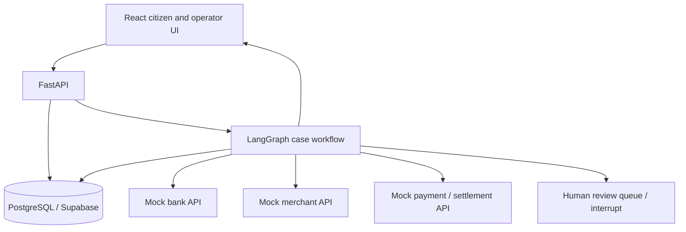

# FinResolve architecture blueprint

## 1. Purpose and system boundary

FinResolve is a decision-support and orchestration layer for complex public financial grievances. A citizen submits one complaint; specialized reasoning and deterministic workflow logic coordinate evidence gathering and actions across simulated institutions; the interface presents progress, evidence, explanations, and a proposed or completed resolution.

The MVP should focus on one digital-payment dispute. It demonstrates a real stateful agent workflow with conditional routing, tool use, monitoring, and replanning. It is not a chatbot, an unrestricted autonomous actor, or a live connection to banking infrastructure.

## 2. Architecture at a glance



React handles submission, case status, evidence, plan visualization, review, and resolution. FastAPI authenticates prototype requests, validates input, starts/resumes graph runs, streams or returns events, and mediates persistence. LangGraph owns the workflow and checkpointed state. PostgreSQL stores durable case records and audit events. Mock connectors return synthetic records and can change between checks to prove adaptation.

## 3. Graph nodes and transitions

| Node | Responsibility and input | Output / state changes | LLM? / tools | Failure and routing |
|---|---|---|---|---|
| `intake` | Validate complaint text and optional identifiers; normalize fields | Case ID, normalized complaint, initial evidence, timestamps | Deterministic; no tools | Invalid input returns validation errors; missing transaction ID continues to triage with a missing-info flag |
| `triage` | Classify domain, issue, urgency, identifiers, and information gaps | Structured classification, stakeholders, confidence, missing info | Structured LLM; no external mutation | Parse/low-confidence result routes to human review or requests information |
| `gather_evidence` | Retrieve records for known transaction identifiers | Evidence records with source, timestamp, status, freshness | Deterministic connector calls; read-only mock APIs | Timeout/error becomes a recorded unavailable source; continue if enough evidence, otherwise review |
| `skeptic_conflicts` | Compare complaint assertions and source records; identify contradictions | Conflicts, supporting/counter evidence links, uncertainty | Structured LLM analysis over bounded evidence; no write tools | Malformed output retries once then review; no conflict is an explicit result |
| `stakeholders` | Identify implicated agencies/parties from classification and evidence | Stakeholder list, responsibility rationale | Deterministic mapping with optional LLM suggestion; no tools | Unknown party becomes an unresolved stakeholder and can trigger review |
| `planner` | Propose tasks, dependencies, prerequisites, and completion criteria | Proposed task DAG with rationale and expected evidence | Structured LLM; cannot call APIs or write DB | Missing prerequisite or invalid schema causes one repair attempt then review |
| `validate_plan` | Enforce task allowlist, identifiers, scope, DAG acyclicity, dependency references, policy gates | Validated plan or validation errors | Deterministic Pydantic + graph checks; no LLM | Invalid plan returns to planner once; repeated failure goes to human review |
| `execute_ready_tasks` | Execute only validated, ready, allowlisted mock actions | Task results, new evidence, audit events; advances task statuses | Deterministic tool dispatch; no LLM | Idempotency, timeout, permission and API errors become explicit task outcomes; dangerous/unsupported action is blocked |
| `monitor` | Reconcile results, detect changed/new evidence, evaluate completion and confidence | Updated status, evidence delta, completion decision | Deterministic rules; concise LLM summary optional | Incomplete/ambiguous result routes to replanning or review |
| `replan` | Incorporate evidence delta and prior plan results into revised task plan | New plan version and reason | Structured LLM; no direct tools | Bounded number of cycles; threshold/loop limit routes to human review |
| `human_review` | Pause for operator decision, information request, approval, or override | Reviewer decision, note, approved task scope, timestamp | Deterministic interrupt/resume; person decides | Rejection closes/escalates; approval resumes only permitted path |
| `resolve_or_escalate` | Produce evidence-backed outcome or escalation packet | Resolution summary, evidence references, status | LLM may draft language from verified facts; deterministic status/persistence | Cannot mark resolved without required evidence and successful terminal criteria |

Suggested graph:

```text
START → intake → triage → gather_evidence → skeptic_conflicts → stakeholders
      → planner → validate_plan ──valid──→ execute_ready_tasks → monitor
                           ↑ invalid (one bounded repair)      ├─ new evidence / incomplete → replan → validate_plan
                           └───────────────────────────────────┘
monitor ──complete + sufficient confidence──→ resolve_or_escalate → END
monitor ──ambiguous / high risk / cycle cap──→ human_review ⇄ resume
triage / evidence / plan failure ────────────→ human_review
```

Actual concurrency can be added later: independent read-only evidence lookups and independent ready tasks may execute in parallel, while the dependency validator and side-effect idempotency remain authoritative.

## 4. How the prototype demonstrates agency

The graph keeps typed state across nodes; makes conditional decisions from evidence and confidence; validates a generated dependency graph; executes approved tools; observes changed results; and can revisit the plan. Every mutation is deterministic and audited. The LLM supplies bounded interpretations and plans but cannot select arbitrary URLs, issue arbitrary SQL, or execute unvalidated actions.

## 5. State and persistence

The complete proposed case state and durable/transient split are defined in [Data and API contracts](contracts.md). Keep only the current run's working context, prompts' bounded evidence excerpts, and intermediate structured outputs in checkpointed graph state. Persist business records, plan/task versions, evidence metadata, human decisions, and append-only audit events. Avoid storing hidden chain-of-thought; retain concise rationale, uncertainty, input evidence IDs, and decision reasons.

## 6. Trust and control boundaries

- Validate request and LLM outputs with Pydantic; reject unknown fields where practical.
- Scope tool calls to synthetic case IDs and fixed connector operations.
- No LLM-created URL, SQL, credentials, or direct database/API access.
- Enforce idempotency keys and task state transitions in deterministic services.
- Record who/what performed each operation, inputs, outcome, timestamps, and related evidence IDs.
- Gate low-confidence, high-risk, unsupported, and repeated-failure paths for human review.
- Use synthetic/anonymized data only; do not place secrets or real account information in demo data.
- For a production deployment, identity, authorization, retention, privacy, security review, and institution integration require separate design and validation.
